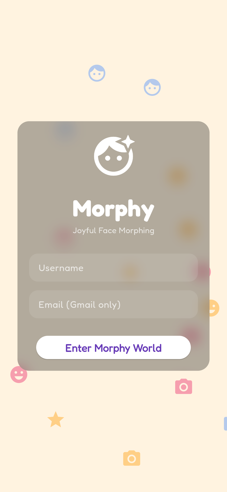
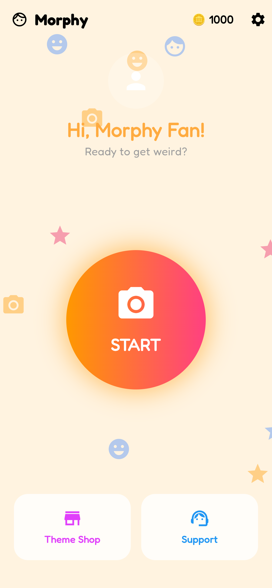
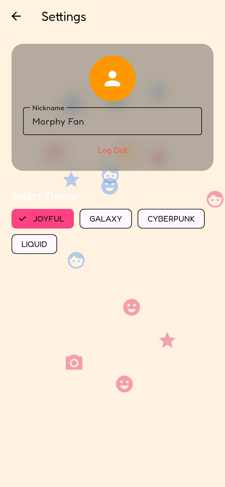
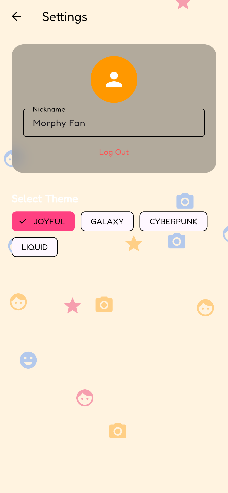
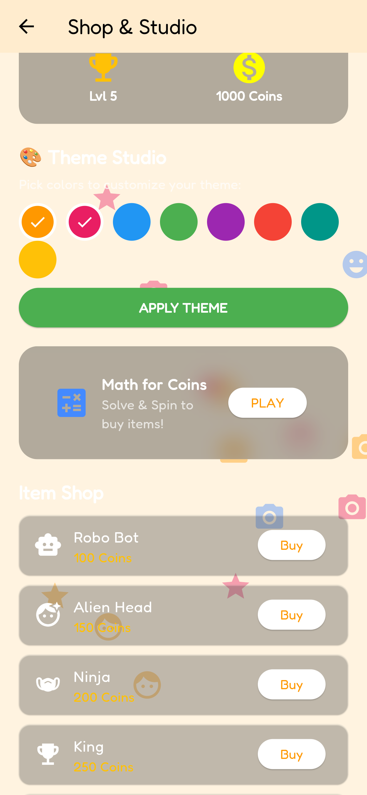
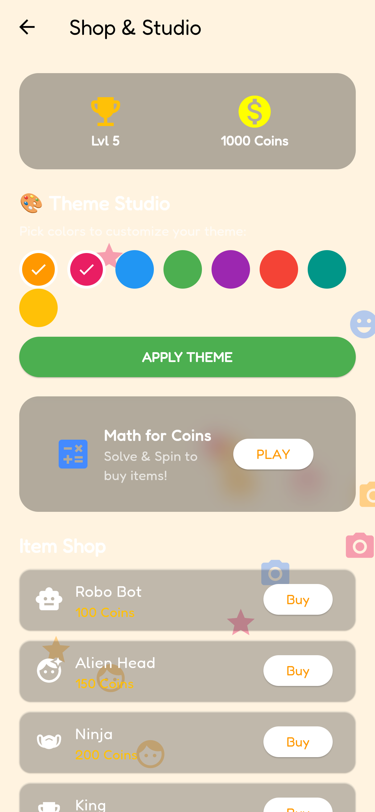
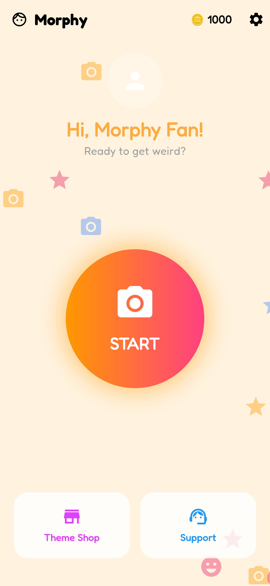
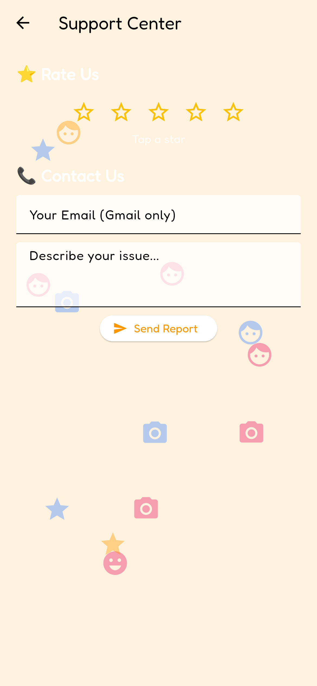

# 🌌 MORPHY & SNAP FILTER PRO
### *The Next-Gen Immersive Face-Morphing & AR Filter Ecosystem*

[](https://flutter.dev)
[](https://python.org)
[](https://google.github.io/mediapipe/)
[](LICENSE)

---

## ⚡ Project Overview

**Morphy** is a high-fidelity, hybrid Augmented Reality (AR) and face-morphing platform designed to bridge premium mobile user experiences with ultra-low latency desktop computer vision engines. The ecosystem is split into two advanced subsystems:

1. **🎨 Morphy Mobile Client (Flutter):** An immersive mobile application showcasing a **Generative UI Engine** with four distinct themes (Joyful, Galaxy, Cyberpunk, and Liquid), interactive particle physics, an in-app Avatar & Shop system, real-time accent customization (Theme Studio), math challenges for currency, and a comprehensive photo editor.
2. **🎭 Snap Filter Pro (Python Desktop AR):** A high-performance real-time face-morphing engine powered by **MediaPipe Face Mesh**, **OpenCV**, and **Pygame**. It implements Delaunay Triangulation, custom neck-cut segmentation, opacity blending, and sound triggers synced to real-time mouth aspect ratio analysis.

---

## 📸 Visual Showcase

### Flutter Mobile App Screens

| 🔐 Next-Gen Login | 🏠 Home Screen (Joyful) | 🏠 Home Screen (Galaxy) |
| :---: | :---: | :---: |
|  |  |  |

| ⚙️ Theme Selection | 🎨 Theme Studio (Cyberpunk) | 🪙 Item & Avatar Shop |
| :---: | :---: | :---: |
|  |  |  |

| 🌌 Shop & Studio (Galaxy) | 🏠 Home Screen (Cyberpunk) | 📞 Support & Feedback |
| :---: | :---: | :---: |
|  |  |  |

---

## 🧠 Key Features & Subsystems

### 1. 📱 Flutter Mobile Subsystem (`task5_face_app`)
* **Generative Themes:**
  * **Joyful:** Light and playful theme featuring warm gradients and floating, drift-animated functional icons.
  * **Galaxy:** Deep celestial backgrounds with real-time stardust particle physics and interactive ambient glows.
  * **Cyberpunk:** A nostalgic 80s neon aesthetic featuring custom-rendered scanline grids and perspective projection.
  * **Liquid:** Soothing ocean-cyan theme with slow, organic floating bubbles.
* **Palette Customization (Theme Studio):** A dynamic color coordinator allowing users to mix accent palettes on-the-fly, instantly compiling new asset themes using Flutter’s reactive state management.
* **Gamified Economy & Shop:**
  * **Earn Coins:** Solve real-time mental arithmetic challenges coupled with a randomized prize wheel spinner.
  * **Avatar & BG Customization:** Unlock advanced shop items (Robo Bot, Alien Head, Spooky Pack, Sports Pack) to fully personalize user cards.
* **Creative Media Lab:** Camera view toggles, image scale and real-time zoom controls, interactive countdown timers, and integrated filter/brightness/sticker editors.

### 2. 🐍 Python Desktop AR Subsystem (`UI`)
* **Delaunay Triangulation Warping:** Extracts 468 high-precision 3D facial landmarks to map and morph custom textured assets onto the user's face with pixel-perfect perspective mapping.
* **Intelligent Neck-Cut Segmentation:** Combines MediaPipe's Selfie Segmentation neural network with a geometric jawline-polygon mask to keep cheeks and shoulders intact while cleanly cropping the neck area.
* **Audio-reactive Synthesizer:** Detects the user's mouth-opening ratio in real-time. Exceeding a calculated threshold dynamically plays high-fidelity audio loops (.mp3/.wav assets corresponding to the selected filter) using `pygame.mixer`, stopping instantly upon mouth closure.
* **Opacity Blending:** Precise sliders to alter filter blending alpha levels on the fly.
* **Clean Snapshot Captures:** Instantly saves current filter frames as high-resolution PNGs.

---

## 🛠️ Installation & Setup

### Prerequisites
* **Flutter SDK:** `>=3.2.0 <4.0.0`
* **Python:** `3.11.x`
* **Webcam:** Required for python desktop filters.

---

### 1. Flutter Mobile App Client Setup

Navigate to the Flutter directory:
```powershell
cd task5_face_app
```

Get packages and dependencies:
```powershell
flutter pub get
```

#### Run on Windows Desktop:
```powershell
flutter run -d windows
```

#### Run on Web (Chrome):
```powershell
flutter run -d chrome
```

---

### 2. Python Desktop AR Setup

Navigate to the UI directory:
```powershell
cd UI
```

Install the required Python modules:
```powershell
pip install opencv-python mediapipe numpy pygame
```

Launch the filter engine:
```powershell
python Face.py
```

---

## 🎛️ Python Desktop AR Controls

| Action | Control |
| :--- | :--- |
| **Select Category** | Left-Click Category thumbnail at the bottom |
| **Apply Filter** | Left-Click Filter thumbnail in the asset row |
| **Modify Blend Alpha** | Left-Click and drag the **Opacity Slider** (top right) |
| **Take Snapshot** | Click the circular **Capture Button** (bottom center) |
| **Navigate Back / Deselect** | Click **BACK / OFF** button (bottom left) |
| **Exit Engine** | Press `q` or `ESC` |

---

## 🚀 Future Roadmap
* [ ] **Neural Style Filters:** Real-time facial transfer using localized CNNs.
* [ ] **Sub-system Integration:** Direct WebSocket socket link to bridge the Python AR engine directly into Flutter web/desktop views.
* [ ] **Multi-face Tracking:** Support for simultaneous multi-user face morphing.

---

## 📄 License
This project is licensed under the MIT License - see the [LICENSE](LICENSE) file for details.